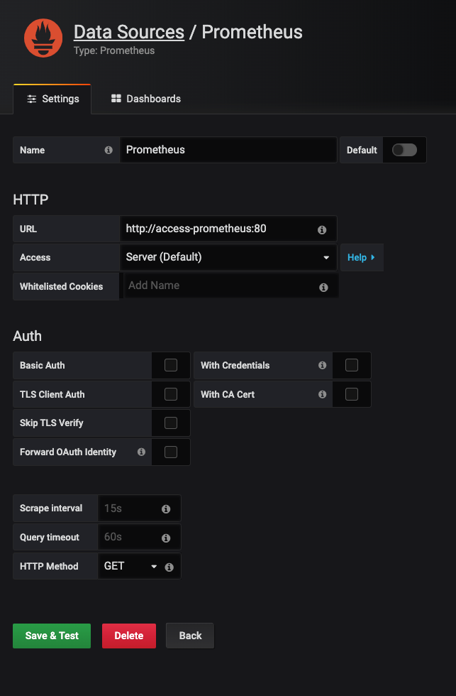
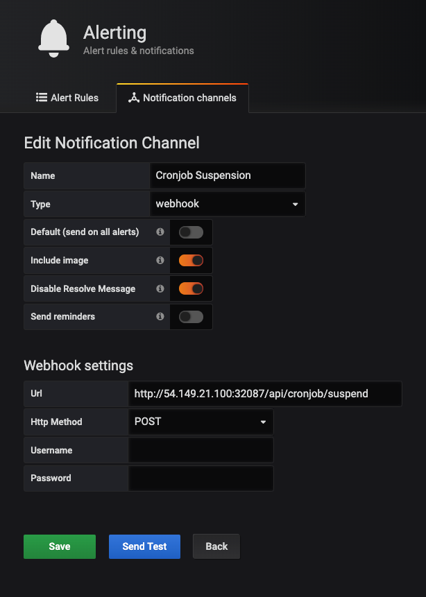
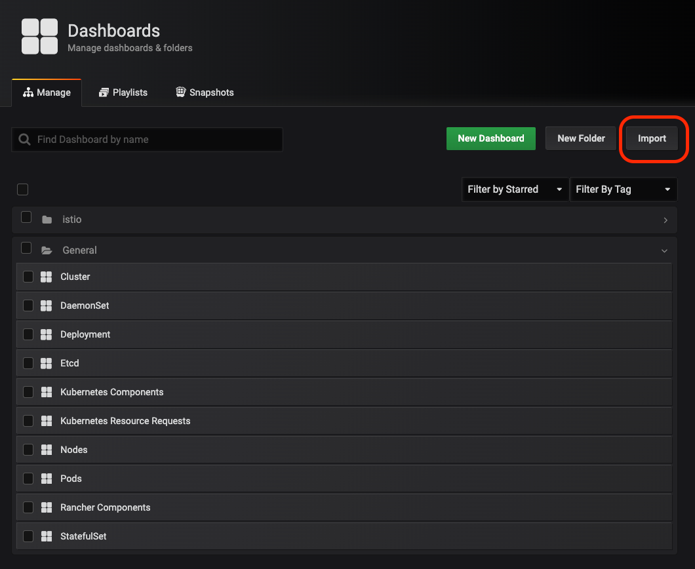
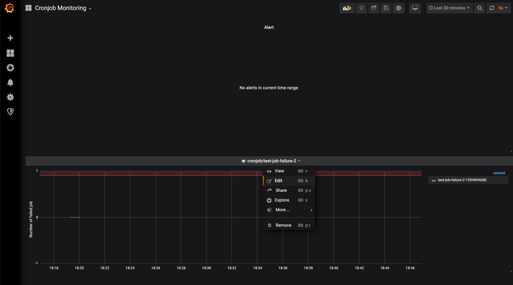
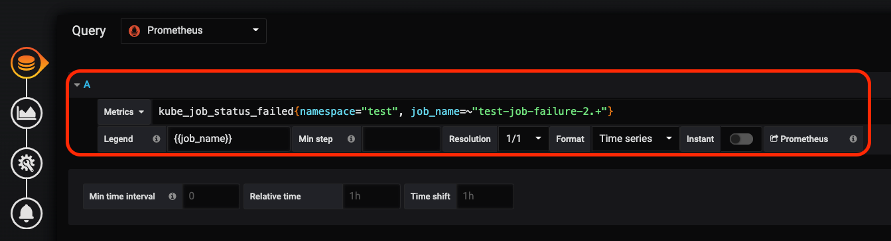
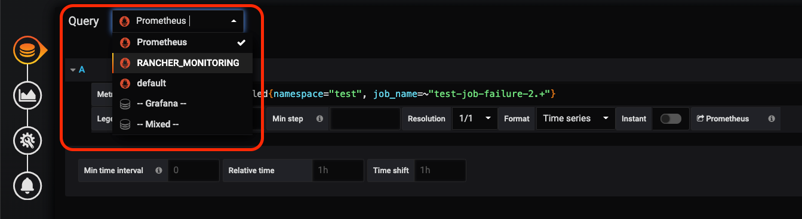
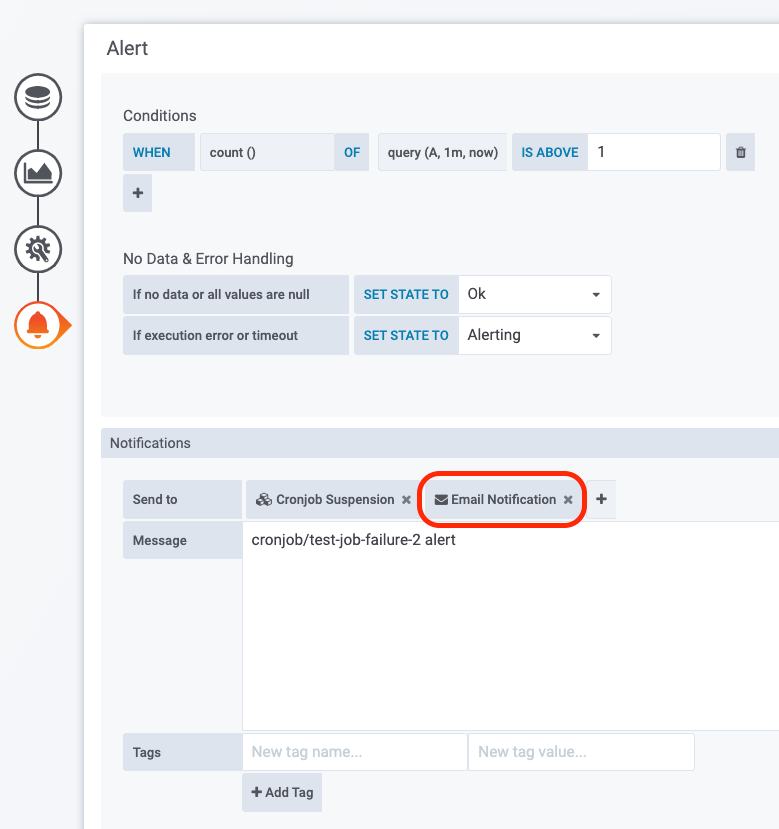
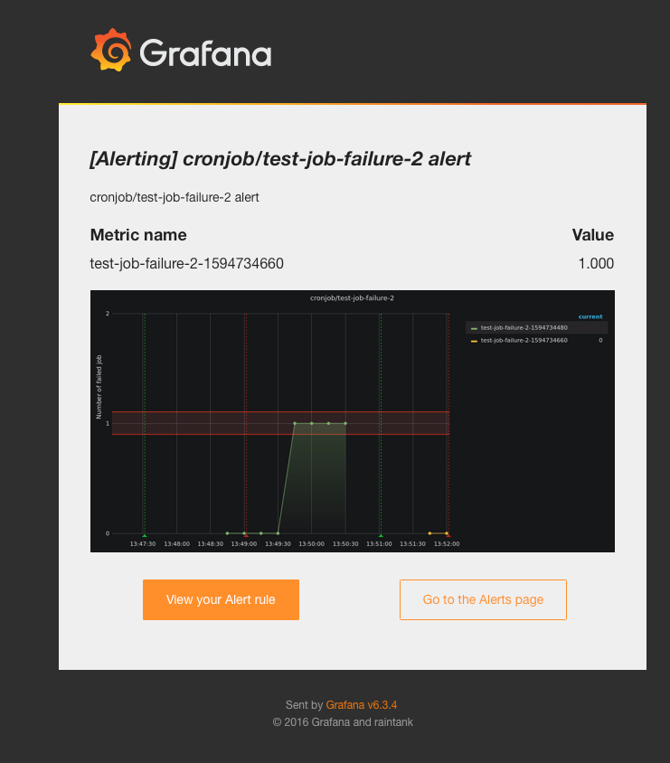
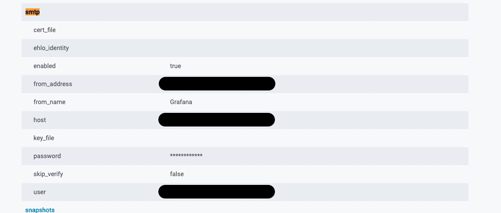
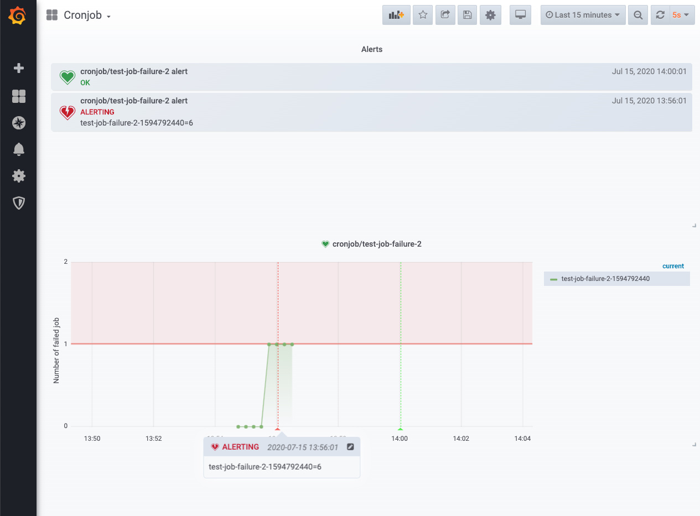

# Grafana Alert

## Requirement

- Cluster has CronJob workloads with BackOffLimit > 0 and FailedJobHistoryLimit > 0
- Cluster also has enable Project level alerting to alert failed jobs by Expression
- Once the alerting is enabled, currently user receives email notification upon failed job (based on BackOffLimit) and resolve email notification (when the Send email upon resolve parameter is checked). This is not what is expected.
- User is looking into the following scenarios:
  - Email notification upon failed job on the final attempt based on the BackOffLimit
  - Upon the above email notification, the next scheduled job (based on Cron schedule) should not run, because the CronJob basically requires manual intervention.

## Alert Design

To have Kubernetes objects monitor in time interval manner, Grafana and Prometheus are utilized and take into account for the proposed design. Prometheus laid the base to work together with [kube-state-metrics](https://github.com/kubernetes/kube-state-metrics), a simple service that will listen to Kubernetes API server and generates required metrics that serve the purpose for monitoring Kubernetes objects. Grafana is then linked with prometheus server and used to query, detect, and send out notification alert via configured webhook upon failed jobs from the specific cronjob.

On receiving HTTP POST request from Grafana, the webhook api will perform its task and suspend cronjob via Kubernetes RESTful api. The api will then remove any failed jobs retain from its `FailedJobHistoryLimit` specification under the CronJob. This is to guarantee successful detection for the next alert trigger from the monitored jobs, given Grafana send out alert based on alert state changes and keeping the failed job will have alert state constantly remain as its last state. This deletion of retained jobs can be optional, however, Kubernetes admin will required to make sure its current alert state is different from it last state in order to have the webhook api working expectedly on next notification trigger.

### How Grafana alert work

Grafana alerts identify problems in moments after they occur. Its alerts consists of two parts:

1. **Alert rules**

   - Alert rules are defined by one or more conditions that are regularly evaluated by Grafana. When an alert changes its alert state (Eg. Ok, No Data, and Alerting), it sends out notifications. In order to add a notification to an alert rule you first need to add and configure a notification channel (can be email, PagerDuty, or other integration).

   - Alert state changes are recorded in the internal annotation table in Grafana’s database. The state changes are visualized as annotations in the alert rule’s graph panel.

2. **Notification channel**
   - How the alert is delivered. When the conditions of an alert rule are met, the Grafana notifies the channels configured for that alert.

**References**

- [Grafana Alert overview](https://grafana.com/docs/grafana/latest/alerting/alerts-overview/)
- [Alert state history and annotations](https://grafana.com/docs/grafana/latest/alerting/create-alerts/#alert-state-history-and-annotations)

## Implementation

#### Tools

- Prometheus
- Grafana
- grafana-alert-api (custom api)

#### Kubernetes Resources

- Namespace
- Service Account
- Cluster Role
- Cluster Rolebinding
- Config Map
- Deployment
- Service

## Setup (Rancher)

Below instructions assumed you have cluster monitoring enabled. If not, please enable it on Cluster > Tools > monitoring.

1. Apply kubernetes resources from file [**requisite.yml**](./manifest/requisite.yml) to your cluster. Make sure environment variables within configMap resource is aligned to your kubernetes resource applications. These are the information required by `grafana-alert-api` (All resources in the yml files will apply to `grafana-alert` namespace, please do change to your preference if needed.)

   ```
   # TODO: replace values within configMap

   # KUBERNETES CONFIG
   ## ClusterIP for service/kubernetes
   KUBERNETES_CLUSTER_URL: <Eg. https://10.43.0.1>

   ## Absolute path to Service Account's token and ca cert within pod/grafana-alert-api
   KUBERNETES_SERVICE_ACCOUNT_CA_CERT_PATH: /var/run/secrets/kubernetes.io/serviceaccount/ca.crt
   KUBERNETES_SERVICE_ACCOUNT_TOKEN_PATH: /var/run/secrets/kubernetes.io/serviceaccount/token
   ```

2. Apply kubernetes resources from file [**deployment.yml**](./manifest/deployment.yml) (Image built from [grafana-alert-api](./grafana-alert-api)) to your cluster. Replace `secretName` within deployment resource specification, to match secret name from newly created service account on step 1. Modify deployment resource if you have any deploy preferences. (All resources in the yml files will apply to `grafana-alert` namespace, please do change to your preference if needed.)
   ```
   secret:
     # TODO: mount to respective secret name from service account
     secretName: grafana-alert-api-serviceaccount-token-zpz2d
   ```
3. Login to Rancher’s Grafana and add new Prometheus data source with url pointed to `service/access-prometheus`. (By default, Rancher monitoring has its Prometheus data source added. This will be use purposely by rancher with url pointed differently, which causes some differences for our use of Grafana alert here).

   

4. Add new notification channel on type webhook with url set as indicated below for cronjob suspension.

   ```
   # TODO: Replace webhook url
   http://<url to service/grafana-alert-api>/api/cronjob/suspend
   ```

   

5. Download file [**Cronjob-Monitoring-Dashboard.json**](./manifest/Cronjob-Monitoring-Dashboard.json) and import it into Grafana. This will create new dashboard specifically use for cronjob monitoring or suspension purposes.
   

6. Go to the imported dashboard and edit cronjob panel.
   

7. Modify panel query with following PromQL. Make sure to replace `namespace` and `job_name` within the query, to match data information of your CronJob.

   ```
   # TODO: Replace namespace and job_name in the query to match information of your CronJob
   kube_job_status_failed{namespace="<namespace>", job_name=~"<cronjob name>.+"}
   ```

   

8. Modify query data source and point it to newly created data source on step 3 :
   

9. Go to Alert tab and make sure the alert configurations are configured as indicated below (These configurations are assumed sample and is adjustable to suit individual use-cases. Any adjustment will post differences to your alerting.)

   ```
   # Rule
   Name <your title name> Evaluates every [30s] For [0m]

   # Conditions
   WHEN [count()] OF [query(A, 30s, now)] IS ABOVE [0.9]

   # No Data & Error Handling
   If no data or all values are null SET STATE TO [Ok]
   If execution error or timeout SET STATE TO [Keep Last State]

   # Notification
   Send to <Your configured notification channel>
   ```

10. If you wish to send email notification, you can configure to send via email notification channel on your created alert notification, the email in below example will be sent upon alert notification triggered.
    
    
    You will also require to enable smtp for email notification in grafana.ini (grafana configuration file). This can be done in configmap/grafana resource. Sample configmap/grafana.
    

## Testing

You can test via personal simulated cron job resource or use the provided cronjob resource.

1. Download file [**cronjob.yml**](./testing/cronjob.yml) (Image built from [test-job](./testing/test-job)) and apply cronjob resources to your cluster. Modify CronJob name and namespace to match PromQL query in your panel (Skip this if you are using your own simulated cronjob).

2. When grafana evaluated the respective alert and found job resource with `BackoffLimitExceeded` status (failed state) from the associated cronjob, its notification alert will be triggered with annotation marked on its panel. The trigger will hit the webhook notification channel and send POST http request to `service/grafana-alert-api`.

   
   `service/grafana-alert-api` will then perform its task on suspending CronJob and removing retained failed jobs based on the job name and namespace received. Removing retained jobs will set its panel’s alerting state apart from state **‘Alerting'**, this help successfully detect the next notification alert when enabling your respective cronjob back alive. Otherwise, it will require kubernetes admin’s effort to alter the panel’s alert state manually.
