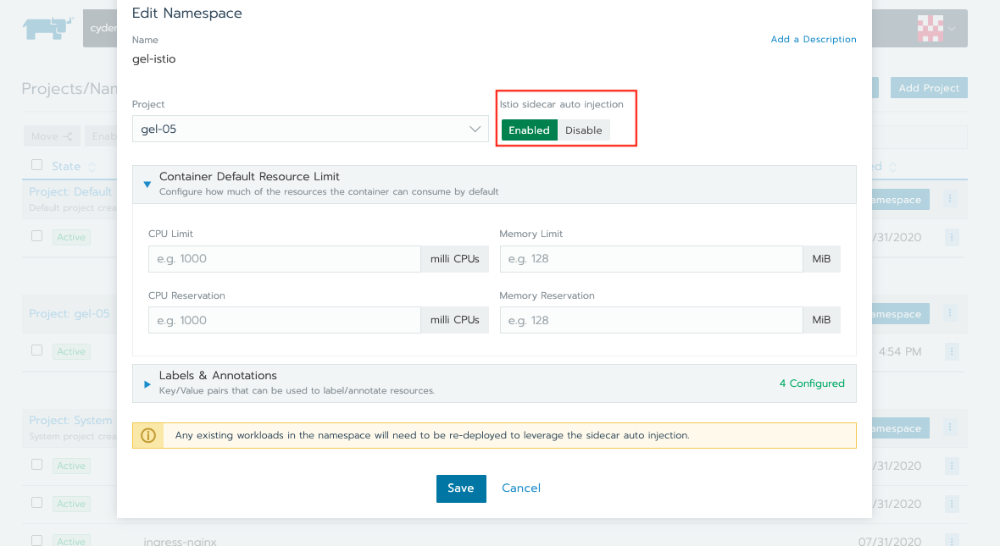

# 1. Istio installation in the cluster

### a. Enable Istio in the cluster

1. From the Global view, navigate to the cluster where you want to enable Istio.

   

2. Click **Tools > Istio** on top menu.

   

   > **Optional**: Configure member access and resource limits for the Istio components. Ensure you have enough resources on your worker nodes to enable Istio.

3. Click Enable and Save.

### b. Enable Istio in a namespace

You will need to manually enable Istio in each namespace that you want to be tracked or controlled by Istio. When Istio is enabled in a namespace, the Envoy sidecar proxy will be automatically injected into all new workloads that are deployed in the namespace.

1. In the Rancher UI, go to the cluster view. Click the **Projects/Namespaces** tab.

   

2. Go to the namespace where you want to enable Istio sidecar auto injection. Then click on `⋮` and edit.

   

3. In the Istio sidecar auto injection section, click Enabled and save.

   

**Excluding Workloads from Being Injected with the Istio Sidecar**

If you need to exclude a workload from getting injected with the Istio sidecar, use the following annotation on the workload:

```
sidecar.istio.io/inject: “false”
```

### References

- [Gettiong Started](https://istio.io/latest/docs/setup/getting-started/)
- [Istio](https://rancher.com/docs/rancher/v2.x/en/cluster-admin/tools/istio/)
