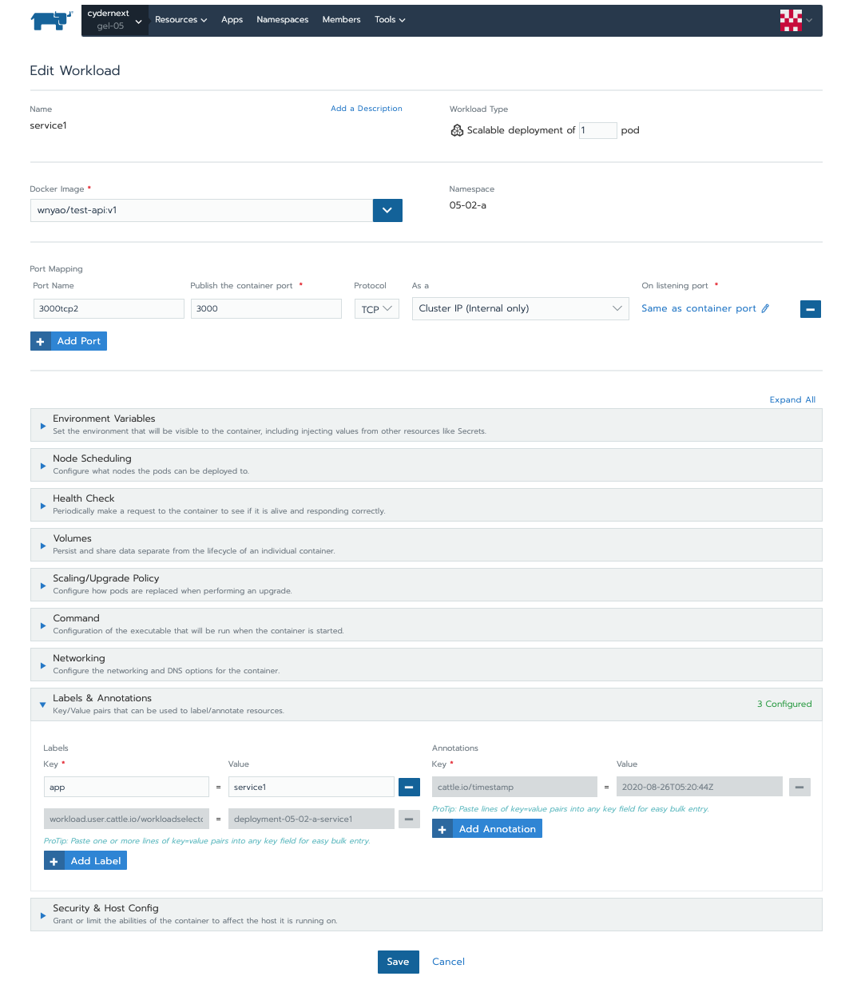
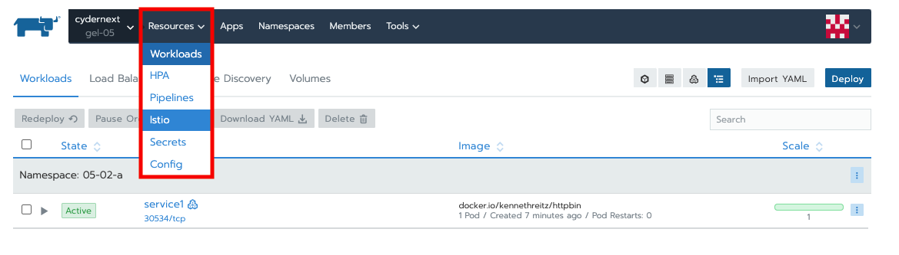
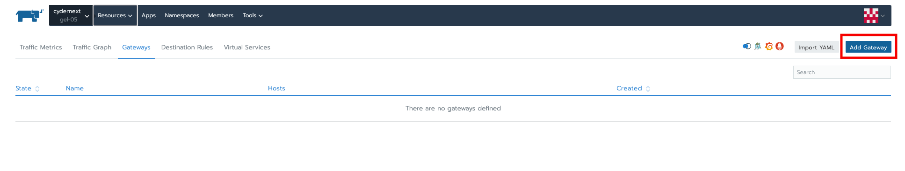
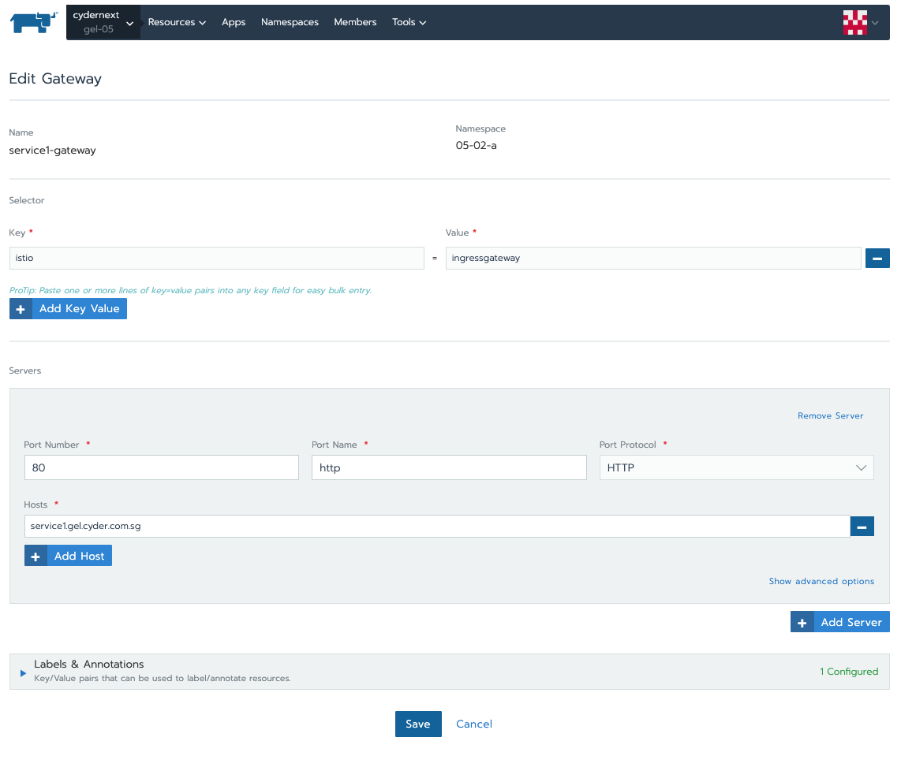
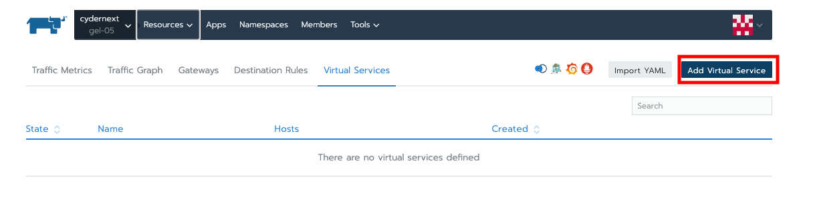
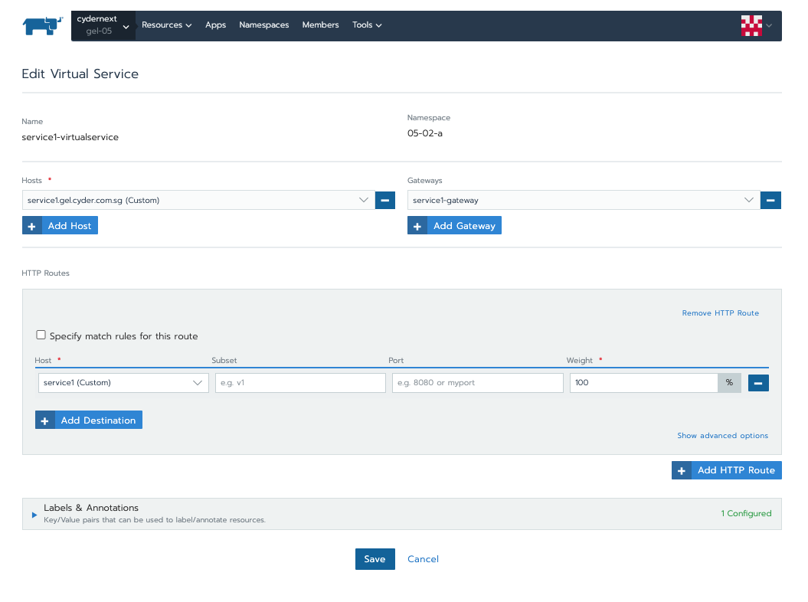
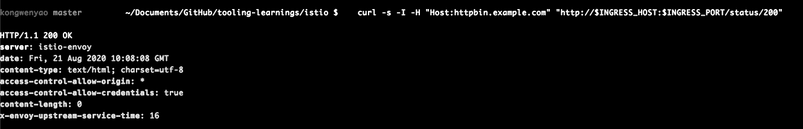
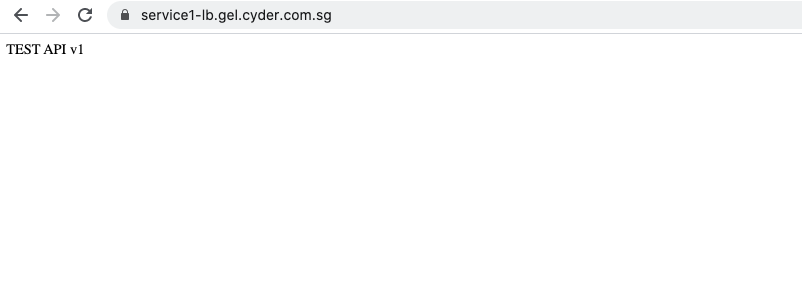

## 2. Enable Istio in both ways via Ingress & Gateways

### a. Using Istio Gateway

1. Deploy workloads as usual if you have enabled **automatic sidecar injection** on you namespace. Istio recommend adding an explicit **app** and **version** label to deployments. The app and version labels add contextual information to the metrics and telemetry Istio collects.

   - **app label:** Each deployment specification should have a distinct app label with a meaningful value. The app label is used to add contextual information in distributed tracing.

   - **version label:** This label indicates the version of the application corresponding to the particular deployment. The version label can be optional, if your deployment doesnt require destination rule for routing granularity, which we will show in this example.

   

2. Create an Istio Gateway. In the example below, we inserted selector `istio:ingressgateway` which will instruct Istio to use its default gateway implementation. We also configure its to listen on HTTP 80 for host `service1.cyder.com.sg`. This can be configured on limiting to host with exact value to access the corresponding service or all traffic with `*`.

   
   
   

3. Add virtual service for configuring routes to direct traffic entering via the gateway. Depend on your preferences, configure section of HTTP Routes to match your routing needs. You will also require to link the virtual service to the gateway you created. In the example below, we map the gateway to `service1-gateway` and destination host within HTTP Routes to `service/service1` where client will connect to.

   
   

4. Access the service using curl via `istio-ingressgateway`

   ```
   # acquire istio ingress gateway host and port
   export INGRESS_HOST=$(kubectl get po -l istio=ingressgateway -n istio-system -o jsonpath='{.items[0].status.hostIP}')
   export INGRESS_PORT=$(kubectl -n istio-system get service istio-ingressgateway -o jsonpath='{.spec.ports[?(@.name=="http2")].nodePort}')

   # curl commands for testing
   curl -s -I -H "Host:service1.gel.cyder.com.sg" "http://$INGRESS_HOST:$INGRESS_PORT/version"
   ```

   **Response**

   

   Note that we use `-H` flag to set the HTTP Host header to `httpbin.example.com`. This is needed because the ingress Gateway is configured to handle `httpbin.example.com`.

5. Accessing service from domain name, `https://service1-lb.gel.cyder.com.sg`
   

### b. Using Istio k8s ingress

Istio k8s ingress only supported on Istio v1.6 and above. Rancher v2.3.5 support Istio v1.4.7 only. This is verifies on bare k8s with Istio v1.4 and v1.7 installation.
