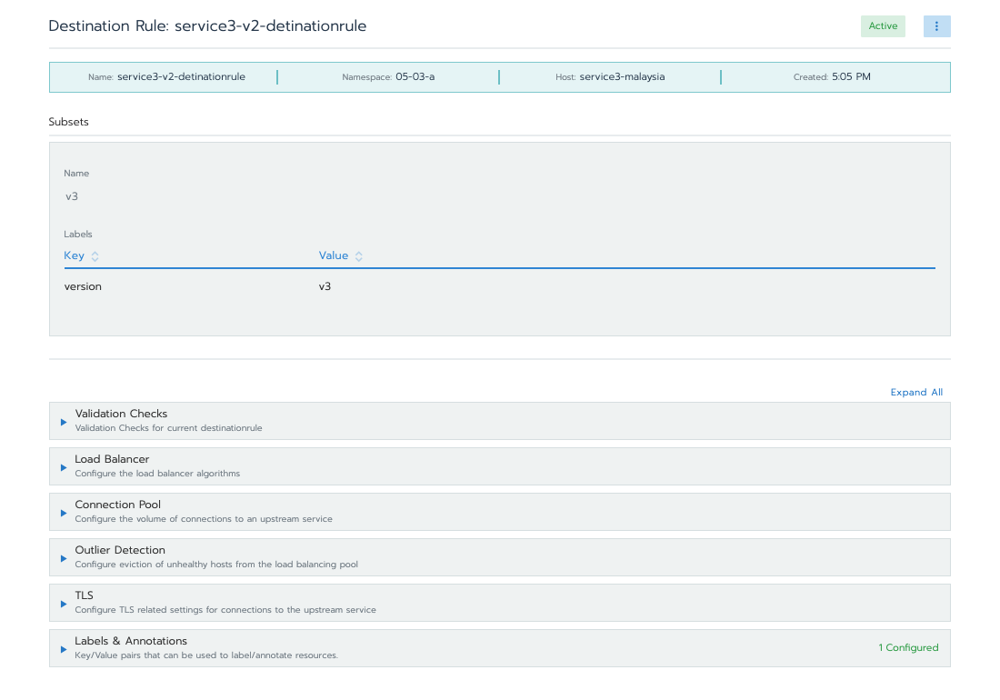
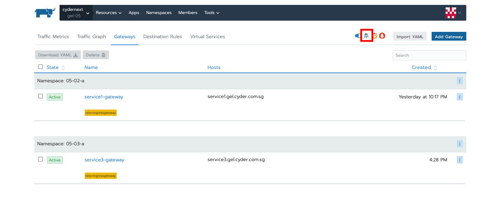

# 3. Configuration of Routing, Tracing & virtualization of services

### a. Request Routing

In this task, we will deployed three workloads and configured request routing between both destinations based on request header `country: singapore` and `country: malaysia`. One of the destination will then further routes traffics to two different version of its service subsets.

1. Deploy three different workloads, here we will deploy `service3-v1`, `service3-v2`, and `service3-v3`. Notice that **app label** here we specify a similar value to the workloads but differentiate them using **version label**.

   
   
   

2. Create service discovery that will route single hostname to the deployed workloads. By default, rancher will create corresponding service discovery for each workload. We will create new record that alias to those DNS records and utilize it on Istio's destination rule.
   
   

3. Create Istio gateway.
   

4. Create virtual service. On http routes, we mapped `host` to the name of Service Discovery's name created on previous step and subset routes to service version. These values will be used in Istio's Destination Rule to determine routing to service subsets.
   

5. Create destination rule
   
   

6. Access the service multiple times with following commands

   ```
    # acquire istio ingress gateway host and port
    export INGRESS_HOST=$(kubectl get po -l istio=ingressgateway -n istio-system -o jsonpath='{.items[0].status.hostIP}')
    export INGRESS_PORT=$(kubectl -n istio-system get service istio-ingressgateway -o jsonpath='{.spec.ports[?(@.name=="http2")].nodePort}')

    # curl commands for testing via ingress gateway
    curl -v -H "Host:service3.gel.cyder.com.sg" -H "country:singapore" "http://$INGRESS_HOST:$INGRESS_PORT"
    curl -v -H "Host:service3.gel.cyder.com.sg" -H "country:malaysia" "http://$INGRESS_HOST:$INGRESS_PORT"

    # curl commands for testing via domain name
    curl -v -H "Host: service3-lb.gel.cyder.com.sg"  -H "country:singapore"  -X GET https://service3-lb.gel.cyder.com.sg
    curl -v -H "Host: service3-lb.gel.cyder.com.sg"  -H "country:malaysia"  -X GET https://service3-lb.gel.cyder.com.sg
   ```

   **Response**

   - For traffic with header `country: singapore`, You will expect to receive different result from the HTTP response if you invoke the curl command multiple time. This is due by the weighting configured on the specified Istio's virtual service that routes requests to version of subsets in a round robin fashion.
     

   - For traffic with header `country: malaysia`, This will route traffic to `service3-v3` workload as configured in our destination rule and service discovery.
     

### b. Tracing with Jaeger

1.  Generate trace information:

    When you enable tracing, you can set the sampling rate that Istio uses for tracing. Use the `values.pilot.traceSampling` option in yaml or navigate to **Project > Istio > Pilot** in Rancher to set the sampling rate. The default sampling rate is 1%.

    To see trace data, you must send requests to your service. The number of requests depends on Istio’s sampling rate. You set this rate when you enable Istio. The default sampling rate is 1%. You need to send at least 100 requests before the first trace is visible. To send a 100 requests to the service, use the following command:

    In this example, we will send requests to `service3` as the guide followed.

    ```
    # acquire istio ingressgateway host and port
    export INGRESS_HOST=$(kubectl get po -l istio=ingressgateway -n istio-system -o jsonpath='{.items[0].status.hostIP}')
    export INGRESS_PORT=$(kubectl -n istio-system get service istio-ingressgateway -o jsonpath='{.spec.ports[?(@.name=="http2")].nodePort}')

    # curl command to generate 500 requests for each route
    for i in `seq 1 500`; do curl -s -H "Host:service3.gel.cyder.com.sg" -H "country:singapore" "http://$INGRESS_HOST:$INGRESS_PORT"; done
    for i in `seq 1 500`; do curl -s -H "Host:service3.gel.cyder.com.sg" -H "country:malaysia" "http://$INGRESS_HOST:$INGRESS_PORT"; done
    ```

2.  Go to Jaeger UI
    

3.  From the left-hand pane of the dashboard, select on service and operation from the drop-down list and click **Find Traces**
    

4.  If you have a more complex microservices structure, you will get more complex tracing details as shown below
    

### c. Virtualization using Kiali

1. Access Kiali traffic graph on Rancher UI

   

2. Access Kiali UI
   

3. View the overview of your mesh in the Overview page that appears immediately after you log in. The Overview page displays all the namespaces that have services in your mesh.
   

4. To view a summary of metrics, select any node or edge in the graph to display its metric details on the summary details panel to the right.
   

5. To view your service mesh using different graph types, select a graph type from the **Graph Type** drop down menu. There are several graph types to choose from: **App, Versioned App, Workload, Service**.

   - **App** graph type aggregates all versions of an app into a single graph node.
   - **Versioned App **graph type shows a node for each version of an app, but all versions of a particular app are grouped together.
   - **Workload** graph type shows a node for each workload in your service mesh. This graph type does not require you to use the `app` and `version` labels so if you opt to not use those labels on your components, this is the graph type you will use.
   - **Service** graph type shows a node for each service in your mesh but excludes all apps and workloads from the graph.

   

### References

- [Request Routing](https://istio.io/latest/docs/tasks/traffic-management/request-routing/)
- [Jaeger](https://istio.io/latest/docs/tasks/observability/distributed-tracing/jaeger/)
- [Kiali](https://istio.io/latest/docs/tasks/observability/kiali/)
