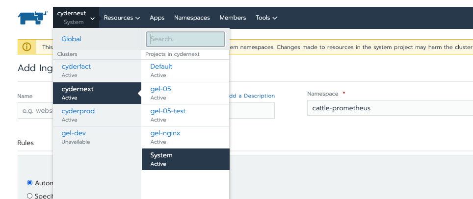
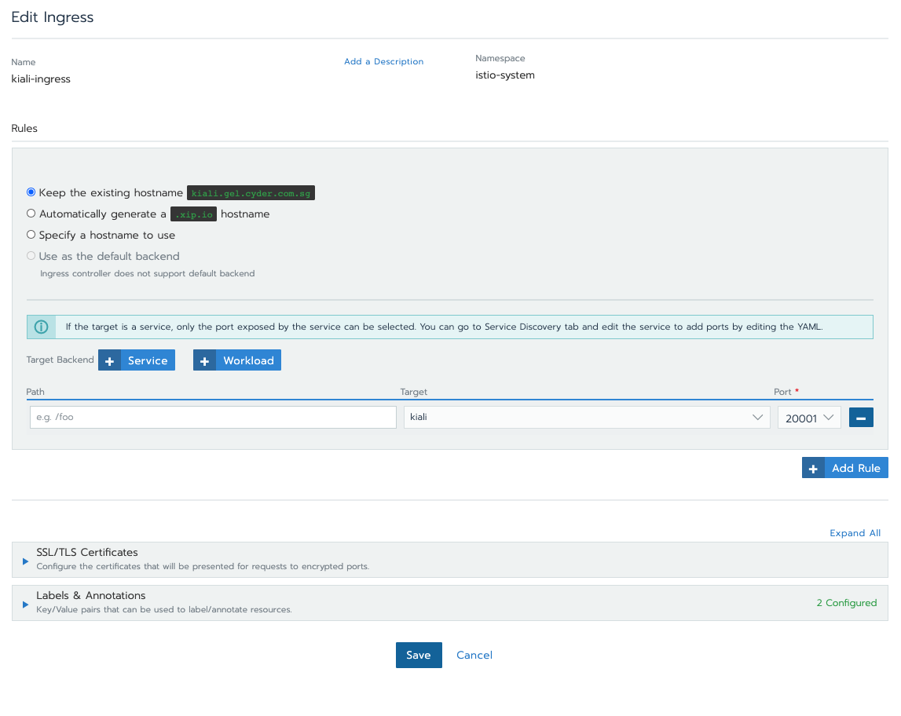
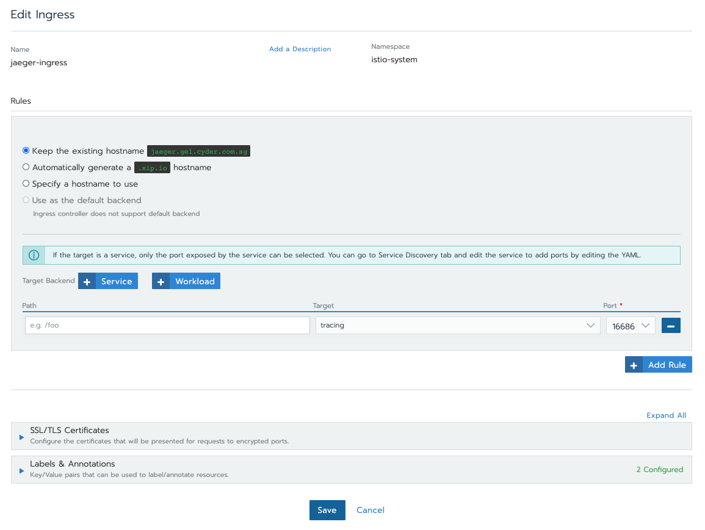
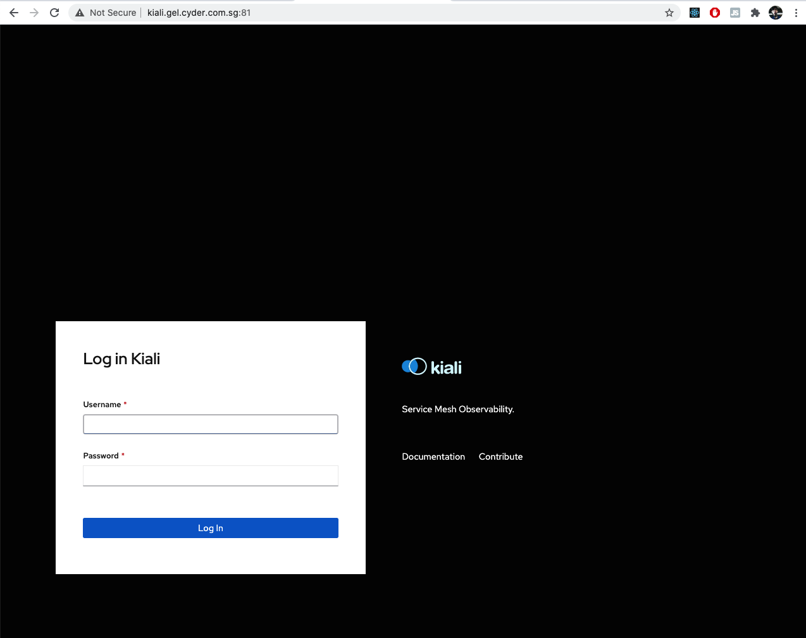
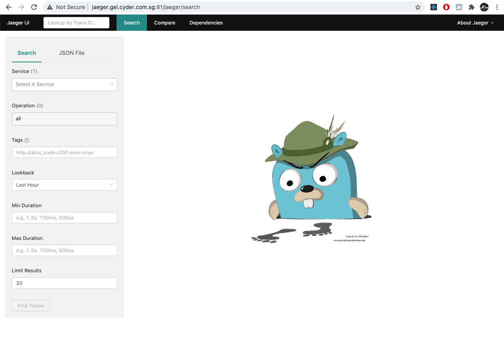
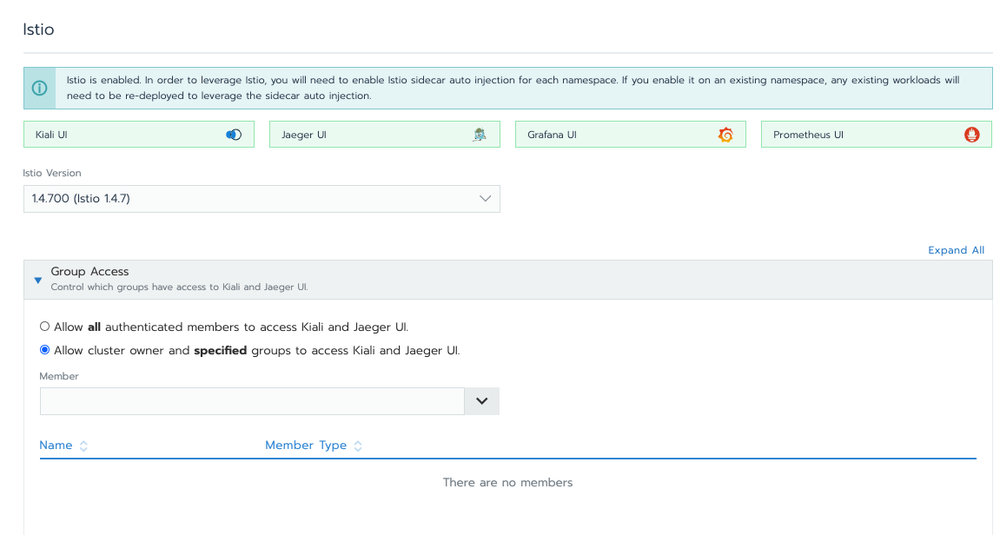
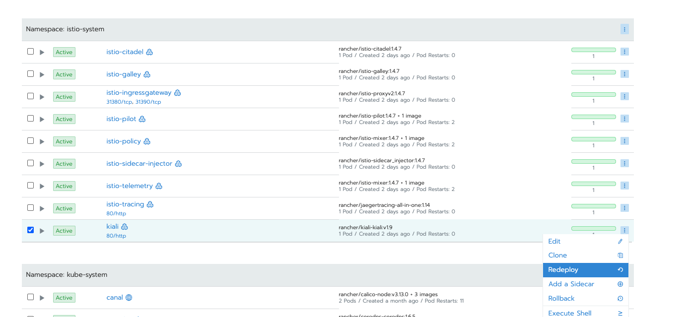

# 4. Exposing of Kiali & Jaeger UI

## a. Create service for Kiali and Jaeger for external access

Remote access to the telemetry addons can be configured in a number of different ways. This task covers basic exposure using Kubernetes ingress. By default, resources for Kiali and Jaeger will come together when you enable Rancher Istio feature. The allocation will be stored under your cluster System under the namespace name, `istio-system`, and can be access or reconfigured accordingly.

1. Navigate to your cluster's System
   

2. Create ingress within `istio-system` namespace, under load balancing tab.
   
   

3. Access the url on browser
   
   

## b. Secure the login to Kiali and Jaeger

### Rancher

By default, Kiali and Jaeger visualizations are restricted to the cluster owner because information in them could be sensitive. Rancher supports giving groups permission to access Kiali and Jaeger, but not individuals. To configure who has permission access to Kiali and Jaeger UI,

1. Go to the cluster view and click **Tools > Istio**.
2. Then go to the **Member Access** section. If you want to restrict access to certain groups, choose **Allow cluster owner and specified members to access Kiali and Jaeger UI**. Search for the groups that you want to have access to Kiali and Jaeger. If you want all members to have access to the tools, click **Allow all members to access Kiali and Jaeger UI**.
   
3. Click Save.

### Kiali

Kiali supports several different login options. Here we will covered those that are useful in Rancher only:

- **login**: This option allows a user to log in to Kiali using a username and password. This is the default option if using Kubernetes. If login strategy is selected during the installation, a secret containing Kiali login credentials is required to be deployed along with Kiali.

  > The login strategy is deprecated and it will be removed in a following release. As an alternative, use the token strategy, which provides similar authentication experience to the Kubernetes Dashboard.

- **anonymous**: This option removes any login requirement. A user will not be presented the login page and will automatically have access to Kiali without having to present any credentials.

- **ldap**: This option allows a user to log in to Kiali using a username and passphrase that is authenticated via a backend LDAP server. This option requires that you configure additional settings in the Kiali CR under `auth.ldap`.

  > The **ldap strategy** is deprecated and it will be removed in a following release. As an alternative, use the **openid** strategy and use an OpenID provider that supports LDAP integration.

* **token**: This option allows a user to log in to Kiali using a Service Account token. This is similar to the [login view of Kubernetes Dashboard](https://github.com/kubernetes/dashboard/blob/master/docs/user/access-control/README.md#login-view). When using this option, the cluster RBAC will take effect and users can access only what is allowed to the Service Account.

* **openid**: This option allows a user to log in to Kiali using an external identity provider that implements [OpenID Connect](https://openid.net/connect/). When using this option, the cluser RBAC will take effect and users can access only what is allowed via the cluster’s authorization mechanisms. This strategy requires that your Kubernetes cluster is configured to accept tokens issued from your identity provider. See the dedicated OpenID section of this page for more information.

  > Using the anonymous option will leave Kiali unsecured. Anyone who can access the console will have full access to Kiali. If you are using this option you will need to make sure that it is only available on a trusted network and that only trusted users can access it.

The login option is specified in the `configmap/kiali`. For instance, to use the login option, the Kiali configuration should contain the following in the auth section:

```
auth:
    strategy: login
```

### Securing using LDAP

Below task assume you have your LDAP server and account created.

1. Edit `configmap/kiali`, ldap login option requires additional settings in the `auth.ldap` section.

   ```
   auth:
     strategy: ldap
     ldap:
       # Replace below values to fit your LDAP server
       ldap_base: "DC=example,DC=com"
       ldap_bind_dn: "CN={USERID},OU=xyz,OU=Users,OU=Accounts,DC=example,DC=com"
       ldap_group_filter: "(cn=%s)"
       ldap_host: "ldap-service.ldap-namespace"
       ldap_insecure_skip_verify: true
       ldap_use_ssl: false
       ldap_port: 123
   ```

2. Once edited redeploy your kiali deployment at **Cluster > System**.
   

3. Test your configurations by login using the account credential in LDAP server through Kiali UI.
   
