# 5. Alert notifications on failure of service routing

For alert & notifications on failure of service routing, we will utilize Grafana. Below instructions assumed you have cluster monitoring enabled. If not, please enable it on **Cluster > Tools > monitoring**.

### a. Grafana configuration

To allow email notification from Grafana, we will need to enable smtp within its configuration. Rancher v2.3.5 cluster monitoring requires further application to modify Grafana's configuration file.

1. Download [**grafana-sample-config.yaml**](./manifest/grafana-sample-config.yaml).
2. Edit smtp configurations within the file and apply to cluster. This configmap will be apply to `cattle-prometheus` namespace which is the namespace used by Rancher's cluster monitoring. Make sure to remove the semicolon prefix on you configured attributes.

   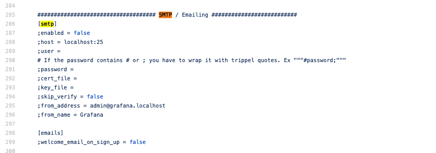

3. Edit `deployment/grafana-cluster-monitoring` and append the following to their location.

   ```
   # configmap volume
   volumes:
    - configMap:
        defaultMode: 420
        items:
        - key: grafana.ini
          path: grafana.ini
        name: grafana-config
      name: grafana-configuration

   # mount path under volume mounts
   volumeMounts:
   - mountPath: /etc/grafana/grafana.ini
     name: grafana-configuration
     subPath: grafana.ini
   ```

4. Login to Grafana and verify the configurations applied at Server **Admin > Settings**.

   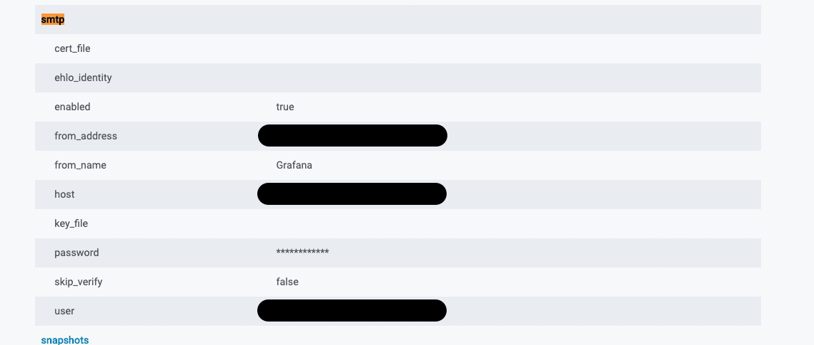

### b. Alert and Notifications

1. Login to Grafana.

   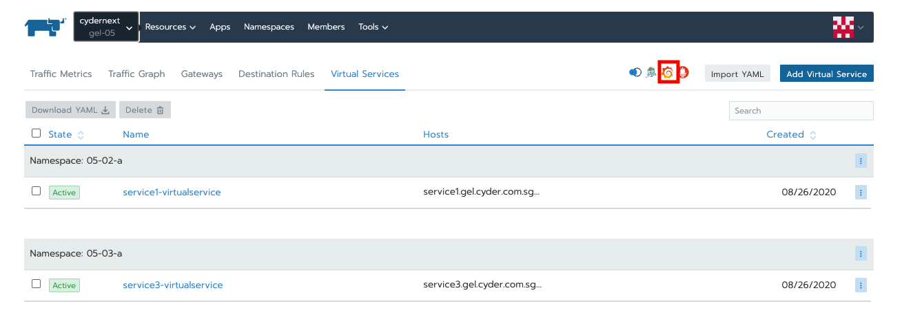

2. Add new notification channel on email type and send test to verify correct configurations.

   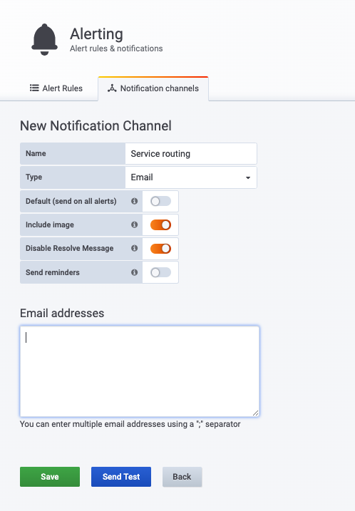

3. Download and import sample dashboard [**istio-routing-request-dashboard.json**](./manifest/istio-routing-requests-dashboard.json). Once imported, you will see several empty graphs as shown in image below.

   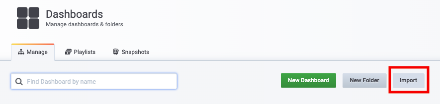
   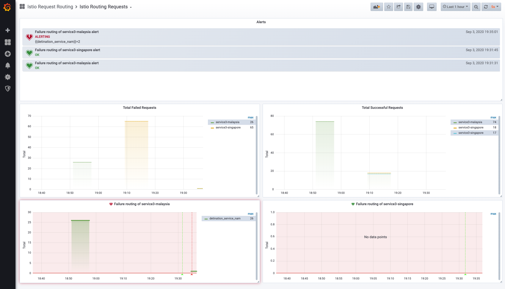

   If you were to edit one of these graphs, you will see query such that `istio_requests_total{destination_service_name="service3-singapore", response_code!="200"}`. This query indicates that we will acquire metrics from `service/istio-ingressgateway` to detination service `service/service3-singapore` with `response_code` not equal to 200.

   Please replace `destination_service_name` to the service name you will like to monitor and set alert.

   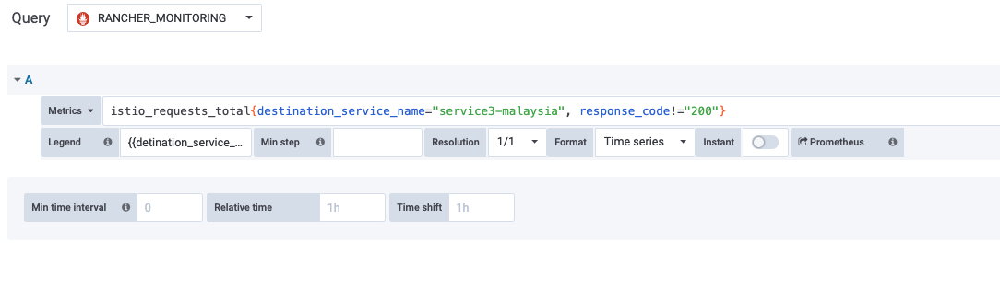

4. Go to Alert tab and create alert with configurations as indicated below. These configurations are assumed sample and is adjustable to suit individual use-cases. Any adjustment will post differences to your alerting.

   ```
    # Rule
    Name <your title name> Evaluates every [30s] For [0m]

    # Conditions
    WHEN [count()] OF [query(A, 30s, now)] IS ABOVE [0]

    # No Data & Error Handling
    If no data or all values are null SET STATE TO [Ok]
    If execution error or timeout SET STATE TO [Keep Last State]

    # Notification
    Send to <Your configured notification channel>
   ```

   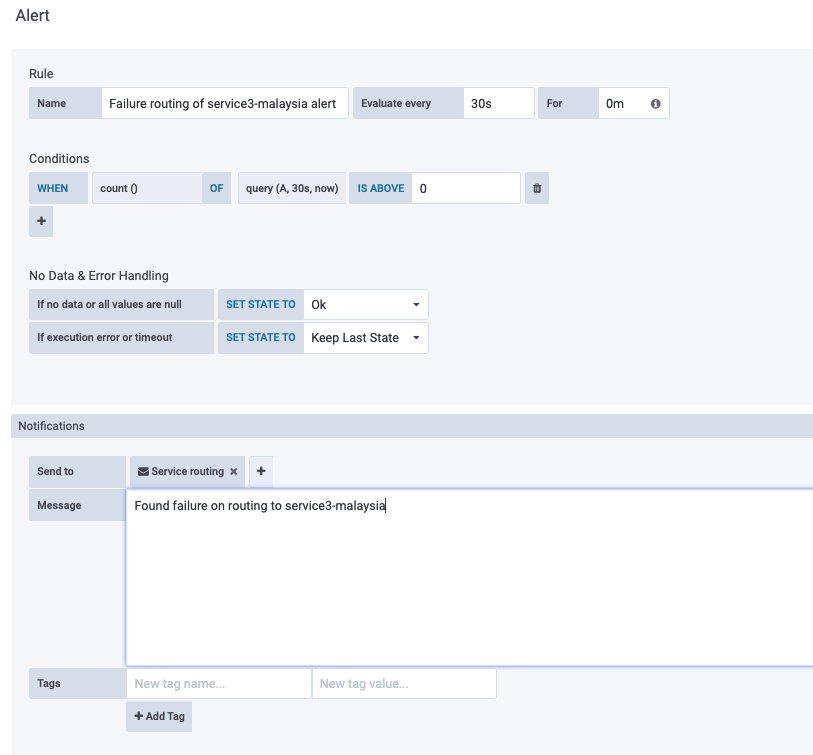

---

### c. Testing

1. Navigate to your **Cluster > Istio > Virtual Services** and edit fault injection of the virtual service that you want to test. In this step, we will inject failure onto traffic routing to `service/service3-singapore`.

   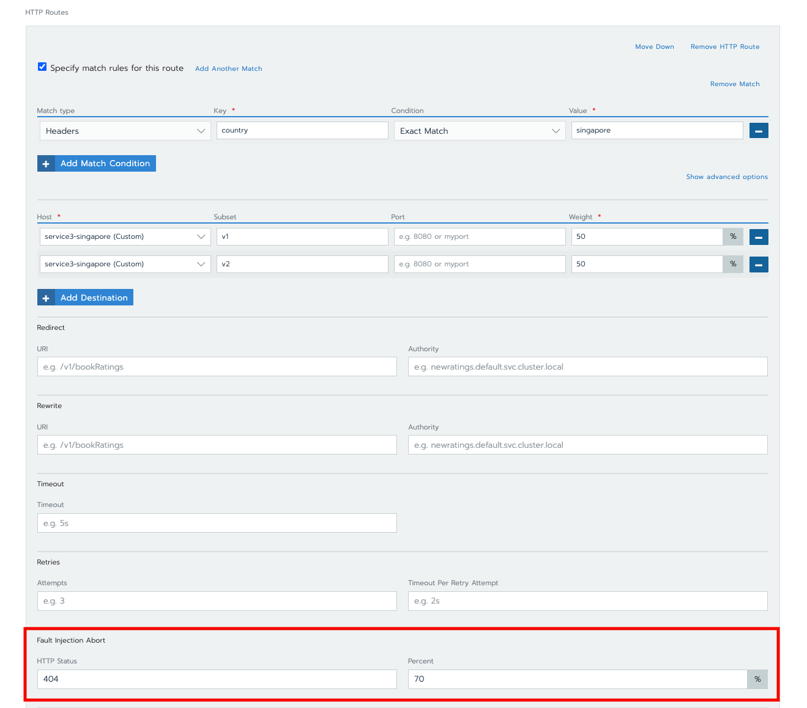

2. Access services

   ```
   # acquire istio ingress gateway host and port
   export INGRESS_HOST=$(kubectl get po -l istio=ingressgateway -n istio-system -o jsonpath='{.items[0].status.hostIP}')
   export INGRESS_PORT=$(kubectl -n istio-system get service istio-ingressgateway -o jsonpath='{.spec.ports[?(@.name=="http2")].nodePort}')

   # curl commands for testing
   for i in `seq 1 100`; do curl -s -H "Host:service3.gel.cyder.com.sg" -H "country:singapore" "http://$INGRESS_HOST:$INGRESS_PORT"; done
   ```

3. Go back to Grafana and wait for the alert. When grafana evaluated the respective alert and found unmatch metric to the query, its notification alert will be triggered with annotation marked on its panel.

   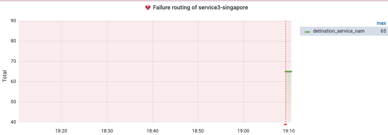
   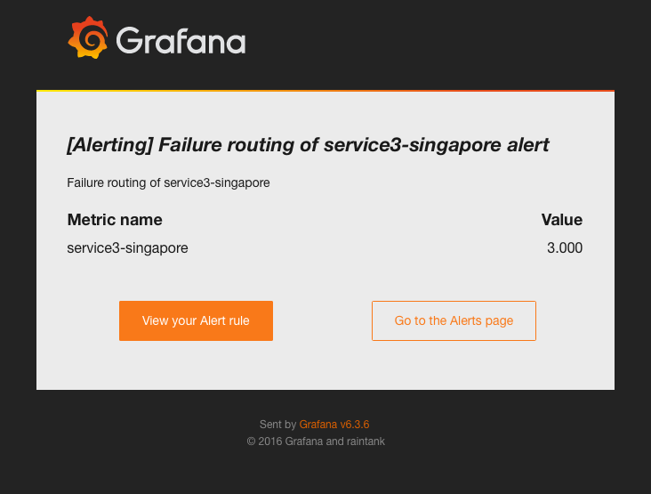
