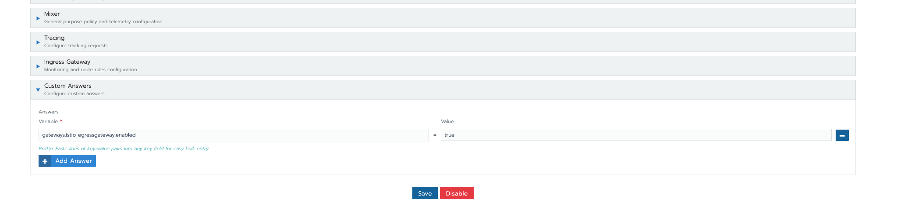

## 7. Using egress gateway

### a. Using Istio Egress Gateway

1. Enable egress gateway via istio's custom answers. As [reference](https://github.com/rancher/rancher/issues/23517#issuecomment-706228930).

   

2. Deploy required [workload](./manifest/config.yaml)

3. Verify Service Entry was applied
   ```
   export SOURCE_POD=$(kubectl get pod -n test-egress -l app=sleep -o jsonpath={.items..metadata.name})
   kubectl exec -n test-egress "$SOURCE_POD" -c sleep -- curl -sL -o /dev/null -D - http://edition.cnn.com/politics
   ```

## Reference

- [Egress Gateway](https://istio.io/latest/docs/tasks/traffic-management/egress/egress-gateway/)
- [RFE: Add support for Egress Gateway in Istio #23517](https://github.com/rancher/rancher/issues/23517)
